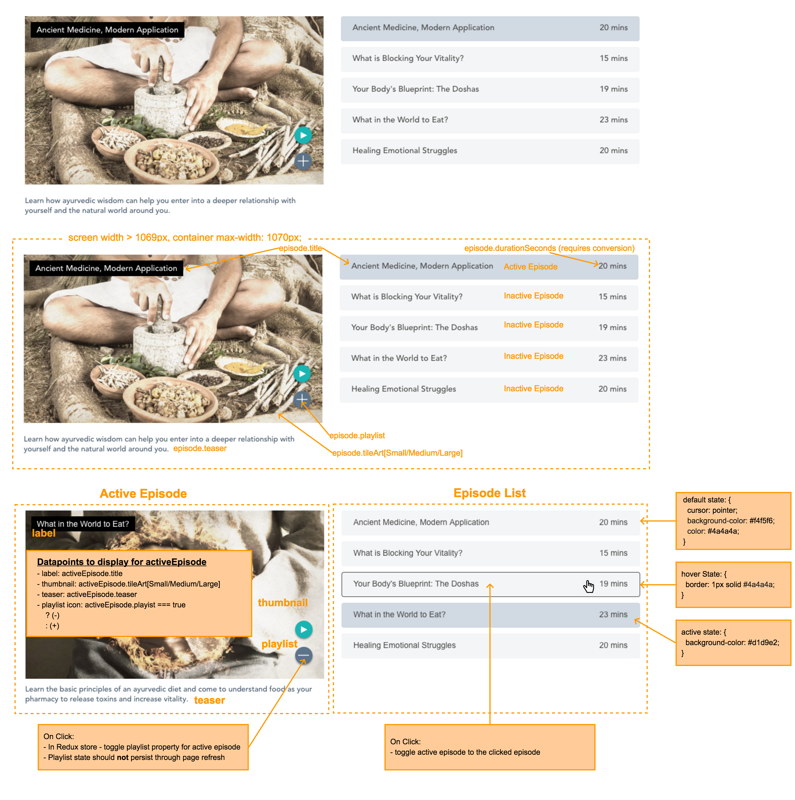
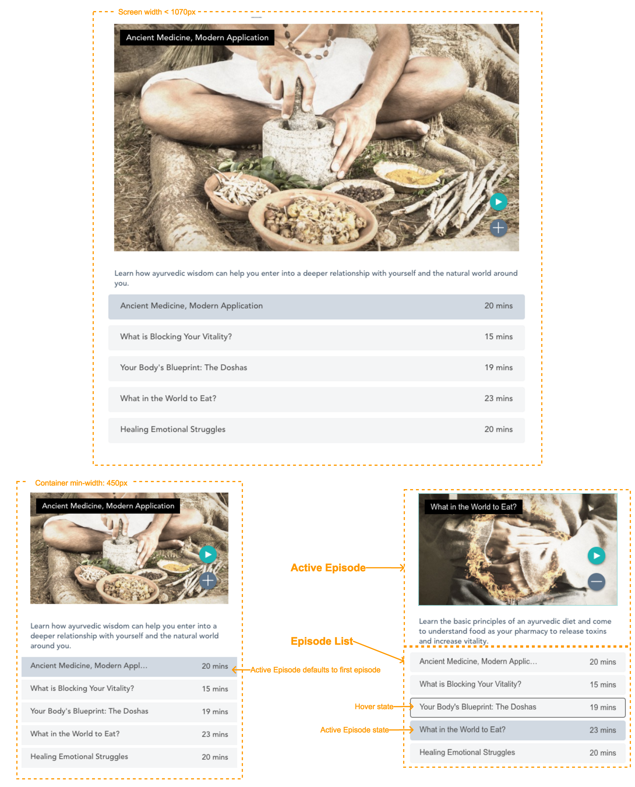

This project was bootstrapped with [Create React App](https://github.com/facebook/create-react-app).

## Mid/Senior Front End Developer Code Challenge

### Pre-requisites:
1. npm >= v5.2
   * Other package managers can be used so long as they are supported by `Create-React-App`
1. Nodejs >= v8.x
1. Two open terminals at the root of the application

### Running the Project:
1. `$ npm install` to install dependencies
1. `$ npm start` to run the React application
1. In the other terminal, `$ npm run server` to run the express server on port: 9001
1. In the browser of your choice, navigate to `localhost:3000`

### Basic Structure:
1. The React application:
   * Uses Redux for global state management
2. The Express server (`/src/server`):
   * Receives http requests from the React application
   * Make http requests to public Gaia API's using Axios
3. Redux pipeline:
   * Actions:
     * Dispatched by the React Application to trigger middleware and reducers
   * Middleware:
     * Listens for actions and maps them to handlers > await an http request to the express server
       * Handles success by dispatching a success action
       * Handles failure by dispatching a failure action
     * Then calls `next(action)` to pass the action to the reducers
   * Reducer - Handles updating application state based on certain actions

### Orienting yourself
* Once the project is running, open the codebase in your editor of choice
* Navigate to `/src/App.js`
* Find the TODO comment in the render method
* In the render method for `<App />`, you will see `episodes`, `seriesProcessing`, and `seriesError`
  * These variables are hydrated from data in the redux store which is populated on mount of `<App />`
  * `seriesProcessing` - Indicates whether or not a series request is being made
  * `seriesError` - Is the error message, should an http request for series fail
  * `episodes` is an array of 5 episode objects in the form:
``` js
  episode = {
    tileArtLarge: string,
    tileArtMedium: string,
    tileArtSmall: string,
    title: string,
    seasonNum: number,
    episodeNum: number,
    durationSeconds: number,
    teaser: string,
    playlist: boolean,
  }
```

### Guidelines:
1. Install and use any packages you wish
1. Add any folders and files you may need to organize your code
1. This codebase has Redux Dev tools enabled
   * [Chrome Extension](https://chrome.google.com/webstore/detail/redux-devtools/lmhkpmbekcpmknklioeibfkpmmfibljd?hl=en)
1. This challenge should take around 3 hours

#### Acceptance Criteria:
*Please meet as many of the following criteria as you can in the allotted time*

1. Build a `<Section />` component from `episodes`:
   * Screen width > 1069px:

   * Screen width < 1070px:


1. **UI requirements:**
   * Section container
     * `max-width: 1070px;`
     * `min-width: 450px;`
   * Breakpoints
     * Screen width > 1069px
       * Active episode/teaser and episode list should render side by side
     * Screen width < 1070px
       * Active episode/teaser should render on top of episode list
   * See large breakpoint mock above for episode list styling based on different states:
     * Default
     * Active
     * Hover
   * Other Specific Styles:
     * Play button - `background-color: #01b4b4;`
     * Play button hover - `background-color: #007172;`
     * Ellipse button - `background-color: #5c738;`
     * Ellipse button hover - `background-color: #44576b;`
   * In episode list, format episode.durationSeconds to nearest `(MM) mins`
   * Use best judgement for spacing within the section
   * Use optimal thumbnail image size as screen width changes
   * For any styling that is undefined, make your best effort to preserve the sprit of the mock images above
   * OPTIONAL - add any additional UI/UX polish
     * Skipping this step will **not** be counted against you

1. **UX Requirements:**
   * Play button `(>)` - onClick:
     * Noop
   * Episode item - onClick:
     * Toggle episode styling in the episode list (see large breakpoint mock above)
     * Toggle the active episode display to the clicked episode
     * The active episode consists of:
       * Label
       * Thumbnail
       * Playlist
       * Teaser
   * Playlist button `(+)/(-)` - onClick:
     * Preferred implementation:
       * Dispatch a Redux action that updates the playlist property on the active episode in the Redux store
     * Playlist state should **not** persist through page refresh
     * Playlist state **should** persist through active episode toggles

### What We're Looking For in Your Code:
  * Implemented functionality meets acceptance criteria
  * It should demonstrate:
    * Understanding of React rendering lifecycle
    * Effective state management
    * Concise CSS
    * Well-defined component Structure
